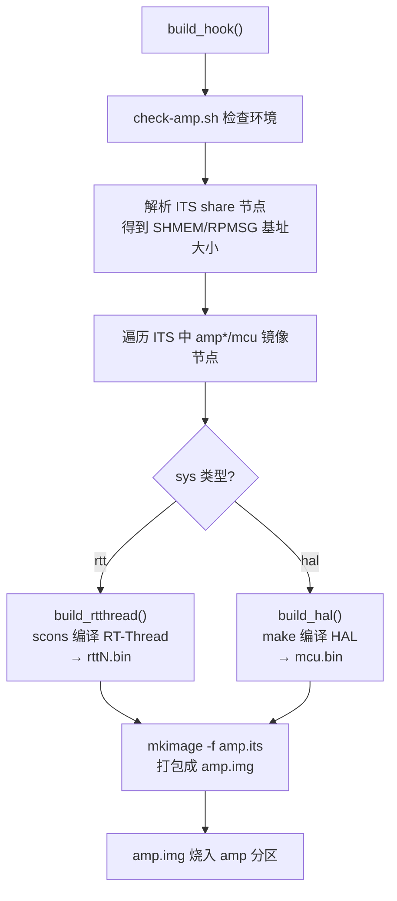
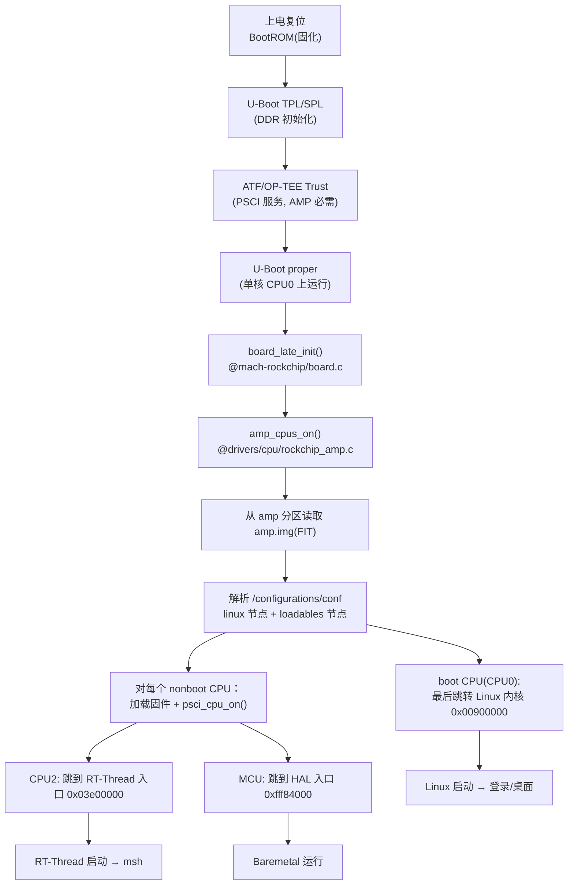
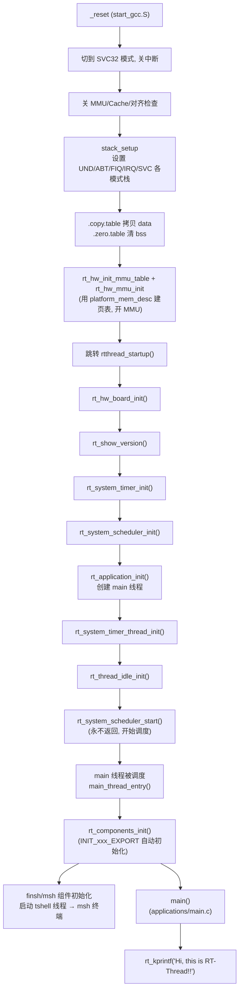
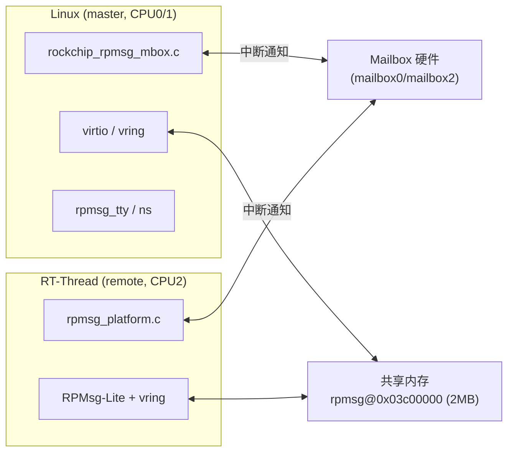
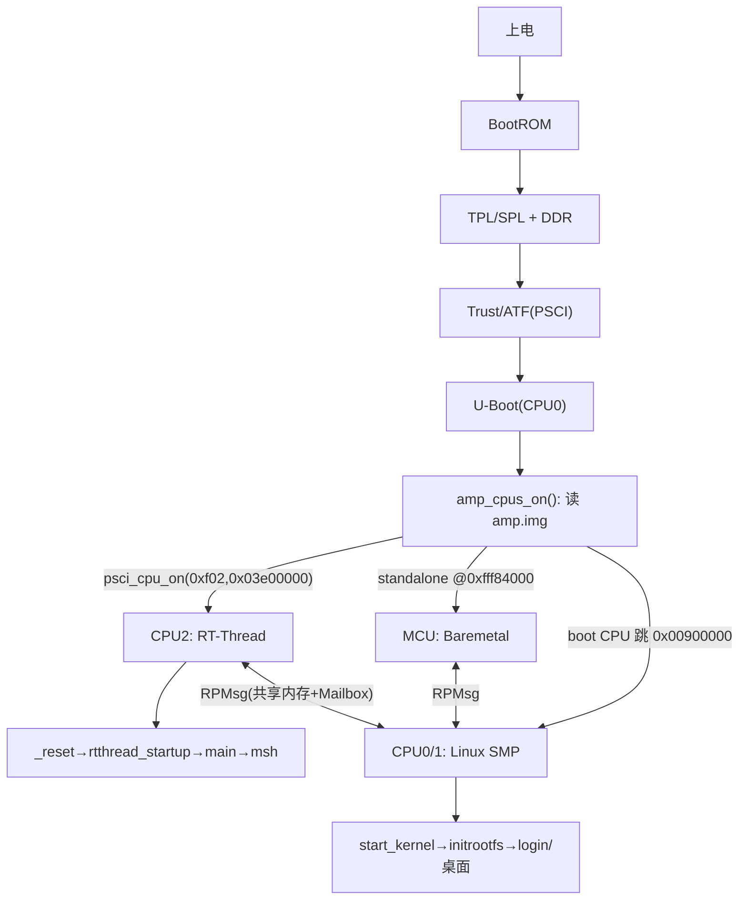

# Rockchip Linux SDK

Rockchip Linux SDK for the Rockchip SOC boards
  - wiki <http://opensource.rock-chips.com/wiki_Main_Page>.

## Quick Start

1. Check supported targets:
```shell
   ~ $ make help
```
2. Choose SDK's defconfig:
```shell
   ~ $ make rockchip_defconfig
```
3. Change SDK's configs:
```shell
   ~ $ make menuconfig
   ~ $ make savedefconfig
```
4. Run "make" to build the images, logs saved at "output/log/"
5. Flash the generated "output/firmware/update.img" to your device
6. Boot your device and enjoy it

---

# RK3506 多核异构（AMP）系统架构详解

> 本章节基于本地 SDK 源码（`u-boot/`、`kernel-6.1/`、`rtos/`、`device/rockchip/rk3506/`）与
> Luckfox 官方 Wiki（Multi-Core-Architecture）整理，覆盖**编译方式、上电启动原理（U-Boot 拉起三核 + RTOS 启动到 msh shell 的每一步函数）、核间通信与配置方式**。

## 一、硬件与方案总览

### 1. SoC 资源

RK3506 内部集成：

- **3 个 ARM Cortex-A7 核心**（CPU0 / CPU1 / CPU2，MPIDR 分别为 `0xf00 / 0xf01 / 0xf02`）
- **1 个 ARM Cortex-M0 MCU**（运行 Baremetal / HAL，位于 SRAM `0xfff80000`）

### 2. 术语

| 术语 | 含义 |
| --- | --- |
| SMP（对称多处理） | 多个同架构核心运行**同一个** OS（如 Linux），由 OS 统一调度，核心地位对等 |
| AMP（非对称多处理） | 不同核心运行**不同** OS / 独立程序（如 Linux + RT-Thread），职责隔离 |
| 异构多核 | 同 SoC 内集成不同架构核心（Cortex-A7 + Cortex-M0） |
| Baremetal | 无 OS 内核，程序直接跑在硬件上（MCU 当前仅支持此模式） |
| RPMsg | 异构核间通信（IPC）标准框架，基于共享内存 + Mailbox 硬件中断 |

### 3. 两种默认 AMP 方案

| 方案 | 核心分配 | 系统组合 | 说明 |
| --- | --- | --- | --- |
| **方案 1** | CPU0/1 跑 Linux，CPU2 跑 RTOS | Linux + RT-Thread | 对应 `amp_linux.its` |
| **方案 2** | CPU0/1/2 全跑 Linux，MCU 跑 Baremetal | Linux + Baremetal | 对应 `amp_linux_mcu.its`（SDK 默认） |

> 基础版 Luckfox Lyra（无 Flash/eMMC）不支持 AMP。

### 4. SMP vs AMP 的本质区别

- **SMP 模式**（普通 defconfig，如 `luckfox_lyra_plus_buildroot_*`）：U-Boot 引导单个 Linux，Linux 内核通过 PSCI 把 CPU1/CPU2 作为 secondary CPU 拉起，三核同属一个内核调度域。对应 `smp.its`。
- **AMP 模式**（`rk3506*_amp_defconfig`）：U-Boot 在引导阶段就把某些 CPU“划走”，分别加载并启动不同的固件（Linux 占用部分 CPU，RT-Thread/MCU 占用另一部分），各系统独立运行、互不调度，仅靠 RPMsg 通信。

---

## 二、目录与关键文件

| 路径 | 作用 |
| --- | --- |
| `device/rockchip/rk3506/rk3506g_buildroot_spinand_amp_defconfig` | AMP 板级总配置（选择 ITS、内核 dts、分区表等） |
| `device/rockchip/rk3506/amp_linux_mcu.its` | **FIT 镜像描述**：方案 2（Linux + RTOS + MCU），定义各核加载地址/入口 |
| `device/rockchip/rk3506/amp_linux.its` | FIT 镜像描述：方案 1（Linux + RT-Thread） |
| `device/rockchip/rk3506/parameter-lyra-spinand-amp.txt` | 分区表，含 `amp` 分区 |
| `common/scripts/mk-amp.sh` | **AMP 编译/打包脚本**（`./build.sh amp` 的实现） |
| `u-boot/drivers/cpu/rockchip_amp.c` | **U-Boot AMP 引导核心**：加载固件、配置 CPU 状态、拉起各核 |
| `u-boot/arch/arm/mach-rockchip/board.c` | U-Boot late init 中调用 `amp_cpus_on()` |
| `kernel-6.1/arch/arm/boot/dts/rk3506-amp.dtsi` | 内核侧 AMP 设备树（`rockchip-amp` / `rpmsg` 节点、保留内存） |
| `kernel-6.1/arch/arm/configs/rockchip_amp.config` | 内核 AMP 功能 config 片段（Mailbox / RPMsg / VirtIO） |
| `kernel-6.1/drivers/rpmsg/rockchip_rpmsg_mbox.c` | 内核侧 RPMsg over Mailbox 驱动 |
| `rtos/bsp/rockchip/rk3506-32/` | **RT-Thread BSP**（board/evb1 配置、链接脚本、应用入口） |
| `rtos/libcpu/arm/cortex-a/start_gcc.S` | RT-Thread Cortex-A 汇编启动入口（`_reset`） |
| `rtos/src/components.c` | RT-Thread C 启动主流程（`rtthread_startup` → main） |
| `rtos/bsp/.../porting/platform/RK3506/rpmsg_platform.c` | RTOS 侧 RPMsg-Lite 平台移植（Mailbox 中断） |

---

## 三、编译方式

### 1. 选择 AMP defconfig

```shell
./build.sh lunch
# 在硬件版本菜单选择对应板型（如 7=custom 或具体 Lyra Plus/Ultra）
# 在 defconfig 菜单选择带 amp 的项，例如：
#   13. rk3506b_buildroot_emmc_amp_defconfig
#   14. rk3506b_buildroot_spinand_amp_defconfig
#   15. rk3506g_buildroot_spinand_amp_defconfig
```

该 defconfig 的关键开关（以 `rk3506g_buildroot_spinand_amp_defconfig` 为例）：

```ini
RK_AMP=y                                       # 启用 AMP
RK_AMP_FIT_ITS="amp_linux_mcu.its"             # 选用方案 2 的 ITS
RK_UBOOT_CFG_FRAGMENTS="rk-amp"                # U-Boot 打开 CONFIG_ROCKCHIP_AMP
RK_KERNEL_CFG="rk3506_luckfox_defconfig"
RK_KERNEL_CFG_FRAGMENTS="rockchip_amp.config rk3506-display.config"
RK_KERNEL_DTS_NAME="rk3506g-luckfox-lyra-amp-spinand"
RK_PARAMETER="parameter-lyra-spinand-amp.txt"  # 含 amp 分区
RK_USE_FIT_IMG=y
```

### 2. 选择跑 RTOS 还是 Baremetal（修改 ITS）

编辑 `device/rockchip/rk3506/amp_linux_mcu.its` 的 `loadables`：

```c
configurations {
    conf {
        loadables = "amp2";   // amp2 → CPU2 跑 RT-Thread
      //loadables = "mcu";    // mcu  → MCU 跑 Baremetal(HAL)
        ...
    };
};
```

- `loadables = "amp2"`：把 `rtt2.bin`（RT-Thread）加载到 CPU2。
- `loadables = "mcu"`：把 `mcu.bin`（HAL Baremetal）加载到 Cortex-M0。

### 3. 完整编译 / 增量编译

```shell
./build.sh            # 首次完整编译（u-boot + kernel + rootfs + amp + 打包）
# 后续可只编译指定模块：
./build.sh amp        # 仅编译 + 打包 AMP 子系统（RT-Thread / HAL）
./build.sh firmware   # 仅重新打包固件
```

### 4. `./build.sh amp` 内部流程（`common/scripts/mk-amp.sh`）



- `build_rtthread()`：进入 `rtos/bsp/rockchip/rk3506-32`，把 ITS 中解析出的
  `load`(FIRMWARE_CPU_BASE)、`srambase/sramsize`、`rpmsg_base/size` 等通过环境变量传入，
  执行 `scons --useconfig=board/evb1/defconfig` 编译，产出 `rttN.bin`。
- `build_hal()`：进入 `rtos/bsp/rockchip/common/hal/project/<target>/GCC`，`make` 产出 `mcu.bin`。
- 最终用 `rtos/tools/mkimage -f amp.its -E -p 0xe00` 把所有非 Linux 固件打包成 **`amp.img`**，
  并刷到 `parameter` 中的 **`amp` 分区**。

---

## 四、上电启动原理（从复位到 shell/桌面）

### 1. 整体启动链



> **关键设计原则**（见 `rockchip_amp.c` 头部注释）：
> - U-Boot 本身始终运行在 **boot CPU（CPU0）** 上；
> - U-Boot **不再负责内存分配/fixup**，内存划分完全由内核 dts 的 `/memory` 与 `reserved-memory` 决定；
> - AMP 功能**依赖 Trust（ATF）**，因为拉起其它 CPU 用的是 PSCI 的 `CPU_ON` SMC 调用。

### 2. U-Boot 如何分别启动三个核（`amp_cpus_on` 详解）

入口在 `board_late_init()`：

```c
// u-boot/arch/arm/mach-rockchip/board.c
cmdline_handle();
#ifdef CONFIG_AMP
    amp_cpus_on();          // ← AMP 引导从这里开始
#endif
return rk_board_late_init();
```

`amp_cpus_on()`（`u-boot/drivers/cpu/rockchip_amp.c`）的步骤：

1. **读取 `amp` 分区**：`rockchip_get_bootdev()` → `part_get_info_by_name(dev, "amp")`，
   先读 4KB FIT 头拿 totalsize，再把整个 `amp.img` 读入内存。
2. **`parse_os_amp_dispatcher()`**：解析内核 dts 的 `/rockchip-amp/amp-cpus`，得到哪些 CPU 被
   “os amp-dispatcher”（即 Linux AMP）占用，这些 CPU 不在 U-Boot 阶段单独 boot。
3. **`boot_get_loadable()`**：把 FIT 中 `loadables` 列出的固件（如 `amp2`=RT-Thread）按其
   `load` 地址加载到 DRAM。
4. **`brought_up_all_amp()`**：核心拉起逻辑——
   - 先处理 `linux` 节点（`brought_up_amp(..., is_linux=1)`），记录 boot CPU 的入口/状态；
   - 再遍历 `loadables`（`brought_up_amp(..., is_linux=0)`），对**非 boot CPU** 调用
     `smc_cpu_on()`：
     ```c
     sip_smc_amp_cfg(AMP_PE_STATE, cpu, pe_state, 0);   // 配置目标 CPU 执行态(arm/thumb/hyp)
     sip_smc_amp_cfg(AMP_BOOT_ARG01/23, ...);            // 仅 Linux 需要 boot 参数
     psci_cpu_on(cpu, entry);                            // PSCI 真正上电并跳到 entry
     ```
   - 每个镜像节点的 `cpu`(MPIDR)、`load`(入口地址)、`arch`(arm/arm64)、`thumb`、`hyp`
     都来自 ITS，例如 `amp2`：`cpu=<0xf02>`、`load=<0x03e00000>` → 即把 RT-Thread 跑在 CPU2。
5. **boot CPU 收尾**：遍历完后只有 boot CPU 能走到末尾，
   - 若 boot CPU 跑 Linux：`cleanup_before_linux()` → `armv7_entry()`（32 位）/`armv8_switch_to_elx`
     跳到内核 `0x00900000`；
   - 若 boot CPU 被 dispatcher 占用（`boot_on=0`）：`psci_cpu_off(0)` 让自己下电，等 Linux 的
     amp-dispatcher 再来接管。

### 3. ITS 中三个系统的入口/地址对照（`amp_linux_mcu.its`）

| 镜像 | 系统 | CPU(MPIDR) | 入口/加载地址 | SRAM | 说明 |
| --- | --- | --- | --- | --- | --- |
| `linux` | Linux | `0xf00`(CPU0) | `0x00900000` | - | boot CPU，由 U-Boot 最后跳入 |
| `amp2` | RT-Thread | `0xf02`(CPU2) | `0x03e00000` | `0xfff80000`(48K) | `data=rtt2.bin` |
| `mcu`  | Baremetal/HAL | Cortex-M0 | `0xfff84000` | - | `type=standalone`，`data=mcu.bin` |
| share | - | - | rpmsg `0x03c00000`，size `0x00200000` | - | 核间共享内存基址 |

### 4. RT-Thread 子系统启动到 msh shell 的**每一步函数**

CPU2 被 `psci_cpu_on(0xf02, 0x03e00000)` 拉起后，从 RT-Thread 固件入口开始：



逐步说明：

1. **`_reset`**（`rtos/libcpu/arm/cortex-a/start_gcc.S`）：
   - `cps #Mode_SVC` 进入 SVC32 模式并关 IRQ/FIQ；
   - 关 MMU、D-Cache、I-Cache、对齐检查、分支预测；
   - `stack_setup` 为 UND/ABT/FIQ/IRQ 各异常模式分配独立栈，最后回到 SVC 模式；
   - 通过 `.copy.table` 把初始化数据从加载域拷到运行域，`.zero.table` 清零 `.bss`；
   - `rt_hw_init_mmu_table` + `rt_hw_mmu_init` 根据 `platform_mem_desc[]` 建立页表并开启 MMU；
   - `ldr pc, _rtthread_startup` 跳入 C 世界。
2. **`rtthread_startup()`**（`rtos/src/components.c`）：
   - `rt_hw_board_init()`（`board_base.c`）：`HAL_Init()` → `BSP_Init()` → IOMUX →
     **UART4 初始化（1500000 波特率，msh 终端就在这个串口）** → `HAL_GIC_Init()` →
     时钟/Tick 初始化 → `rt_system_heap_init()` 建堆 → `rt_components_board_init()`；
   - 依次 `rt_system_timer_init` / `rt_system_scheduler_init`；
   - `rt_application_init()` 创建优先级 10 的 **main 线程**（入口 `main_thread_entry`）；
   - `rt_system_timer_thread_init` / `rt_thread_idle_init`（idle 钩子为 `wfi`）；
   - `rt_system_scheduler_start()` 启动调度器，**此后不再返回**。
3. **`main_thread_entry()`**：调度器运行后 main 线程被选中执行：
   - `rt_components_init()`：遍历 `INIT_*_EXPORT` 自动初始化表，其中 **finsh/msh 组件**会注册并
     拉起 `tshell` 线程，绑定到控制台设备 `uart4`，于是串口上出现 **`msh />` 终端**；
   - 调用用户 `main()`（`rk3506-32/applications/main.c`），打印 `Hi, this is RT-Thread!!`。

> 子系统 UART 引脚：`RX=GPIO0_A3`、`TX=GPIO0_A2`，波特率 **1500000**。上电后该串口输出 msh，
> 输入 `help` 可查看所有命令。

### 5. MCU（Baremetal/HAL）启动

若 ITS 选 `loadables="mcu"`：U-Boot 把 `mcu.bin` 当作 `type=standalone` 处理
（`standalone_handler` 仅 `sysmem_alloc_base_by_name` 占位，不走 `psci_cpu_on`），
MCU 由其复位向量（`startup_rk3506.c` / `start_rk3506_mcu.S`）从 `0xfff84000` 开始执行 HAL 裸机程序。

### 6. Linux 主系统启动

boot CPU（CPU0）跳入内核 `0x00900000` 后，是标准 Linux 启动流程：
`head.S` → `start_kernel()` → 解析 dts → 初始化驱动 →
**AMP 模式下 CPU1（必要时 CPU2）作为 secondary CPU 经 PSCI 加入 SMP 调度** →
挂载 rootfs（`root=ubi0:rootfs ubi.mtd=3 rootfstype=ubifs`）→ init → 登录/桌面/应用。

> dts `chosen/bootargs`：`console=tty1 console=ttyFIQ0 root=ubi0:rootfs ...`。

---

## 五、核间通信（RPMsg over Mailbox）

### 1. 通信模型



- **数据通道**：双方共享一段保留内存（`rpmsg_base=0x03c00000`，2MB），里面放 virtio vring + buffer。
- **通知通道**：通过 **Mailbox** 硬件互相触发中断。Linux 侧 `mboxes=<&mailbox0 0 &mailbox2 0>`，
  RTOS 侧 `rpmsg_platform.c` 注册 Mailbox 中断回调（`rpmsg_master_cb` / `rpmsg_remote_cb`），
  收到 `RL_RPMSG_MAGIC` 后调用 `env_isr()` 唤醒对应 virtqueue。

### 2. 内核侧设备树（`rk3506-amp.dtsi`）

```dts
rockchip_amp: rockchip-amp {            // 声明哪些 CPU/外设/中断归 AMP 子系统
    compatible = "rockchip,amp";
    amp-cpu-aff-maskbits = /bits/ 64 <0x0 0x1 0x1 0x2 0x2 0x4>;
    amp-irqs = /bits/ 64 < ... GIC_AMP_IRQ_CFG_ROUTE(176, 0xd0, ...) >; // 把 UART3/4/I2C0/Mailbox 中断路由给 CPU2
    status = "okay";
};

rpmsg: rpmsg@3c00000 {
    compatible = "rockchip,rpmsg";
    mbox-names = "rpmsg-rx", "rpmsg-tx";
    mboxes = <&mailbox0 0 &mailbox2 0>;
    rockchip,link-id = <0x02>;          // 对端是 CPU2
    reg = <0x3c00000 0x20000>;
    memory-region = <&rpmsg_dma_reserved>;
};
```

保留内存（`reserved-memory`）：

| 节点 | 地址 | 大小 | 用途 |
| --- | --- | --- | --- |
| `amp_shmem_reserved` | `0x03b00000` | 1MB | 远端 AMP 核通用共享 |
| `rpmsg_reserved` | `0x03c00000` | 1MB | RPMsg vring |
| `rpmsg_dma_reserved` | `0x03d00000` | 1MB | RPMsg DMA buffer 池 |
| `mcu_reserved` | `0xfff80000` | 48KB | MCU 运行区（SRAM） |

> 注意：dts 里 `cpus { /delete-node/ cpu@f02; }` —— **把 CPU2 从 Linux 的 CPU 列表中删除**，
> 这样 Linux 不会去管理 CPU2，CPU2 完全交给 RT-Thread。

### 3. 内核 AMP 功能开关（`rockchip_amp.config`）

```ini
CONFIG_ROCKCHIP_AMP=y
CONFIG_MAILBOX=y
CONFIG_ROCKCHIP_MBOX=y
CONFIG_RPMSG=y
CONFIG_RPMSG_VIRTIO=y
CONFIG_RPMSG_ROCKCHIP_MBOX=y      # RPMsg over Mailbox 驱动
CONFIG_RPMSG_NS=y                 # name service
CONFIG_RPMSG_TTY=y                # /dev/ttyRPMSGx
CONFIG_VIRTIO=y
```

---

## 六、配置方式速查

### 1. 切换 RTOS / Baremetal

改 `device/rockchip/rk3506/amp_linux_mcu.its` 的 `loadables`（`"amp2"`=RT-Thread，`"mcu"`=HAL）。

### 2. 调整各核内存布局

- **入口/加载地址、SRAM 范围、RPMsg 共享内存**：改 `*.its` 的 `load`/`srambase`/`sramsize`/
  `share{rpmsg_base,rpmsg_size}`，编译脚本会自动把这些值传给 RT-Thread/HAL 工程。
- **Linux 可见内存与保留内存**：改内核 dts 的 `/memory` 与 `reserved-memory`（U-Boot 不再管内存）。
- **RT-Thread 内部内存映射**：`rtos/.../board_base.c` 的 `platform_mem_desc[]` +
  `gcc_arm.ld.S` 的 `MEMORY{}`（`FIRMWARE_BASE/DRAM_SIZE/LINUX_RPMSG_BASE` 由编译脚本注入）。

### 3. 调整 RT-Thread 功能

`scons --useconfig=rtos/bsp/rockchip/rk3506-32/board/evb1/defconfig`，或进 BSP 目录
`scons --menuconfig` 修改（控制台设备、shell、外设驱动等）。当前默认：
`RT_CONSOLE_DEVICE_NAME="uart4"`、`RT_USING_SMP` 关闭（RTOS 单核跑在 CPU2）。

### 4. 中断/外设归属

在 dts `rockchip-amp` 节点的 `amp-irqs` 用 `GIC_AMP_IRQ_CFG_ROUTE(irq, prio, cpu_affinity)`
把外设中断路由到对应核；RTOS 侧 `board_base.c` 的 `irqsConfig[]` 做对应配置，两边需一致。

---

## 七、启动全景图（一图总览）



